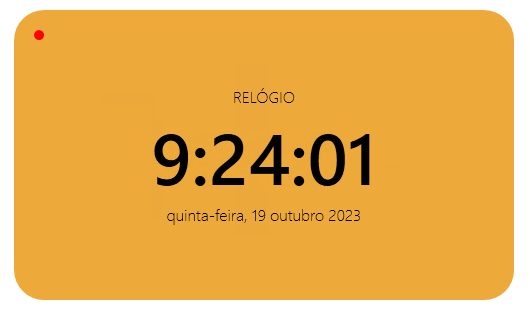

# Relógio Digital

Este é um simples relógio digital implementado em C# usando o Windows Presentation Foundation (WPF). O relógio atualiza a hora, os minutos e os segundos em tempo real e notifica as alterações usando o padrão INotifyPropertyChanged. Além disso, exibe a data atual.



## Conteúdo

- [Visão Geral](#visão-geral)
- [Requisitos](#requisitos)
- [Uso](#uso)
- [Licença](#licença)

## Visão Geral

O código fornece duas classes: `Relogio` e `Data`, ambas implementando a interface `INotifyPropertyChanged`. A classe `Relogio` mantém a hora, os minutos e os segundos, enquanto a classe `Data` mantém a data atual. Ambas atualizam esses valores em tempo real e notificam as alterações usando o evento `PropertyChanged`. Quando qualquer uma das propriedades (Hora, Minuto, Segundo ou Dia) é alterada, o evento `PropertyChanged` é acionado para notificar os assinantes (por exemplo, uma interface do usuário) sobre a mudança.

## Requisitos

Antes de executar o projeto em sua máquina, certifique-se de ter os seguintes requisitos instalados:

- [Visual Studio](https://visualstudio.microsoft.com/) ou qualquer outro ambiente de desenvolvimento C# compatível.

### Biblioteca Windows Presentation Foundation (WPF)

O projeto utiliza a biblioteca Windows Presentation Foundation (WPF) para criar a interface do usuário. Certifique-se de que a biblioteca WPF esteja instalada no seu ambiente de desenvolvimento.

## Uso

1. Abra o projeto no Visual Studio (ou seu IDE de escolha).
2. Certifique-se de que a biblioteca Windows Presentation Foundation (WPF) esteja instalada no projeto.
3. Crie uma instância da classe `Relogio` e da classe `Data` no código da sua aplicação.
4. Assine o evento `PropertyChanged` de cada instância do `Relogio` e do `Data` para receber notificações de mudanças na hora, nos minutos, nos segundos ou na data.
5. Inicie o relógio e a data chamando o construtor da classe `Relogio` e `Data`.

Aqui está um exemplo de como usar as classes `Relogio` e `Data`:

```csharp
using RelogioDigital.Dados;

// ...

Relogio relogio = new Relogio();
relogio.PropertyChanged += (sender, e) => {
    if (e.PropertyName == "Hora") {
        // Atualize a exibição da hora
    } else if (e.PropertyName == "Minuto") {
        // Atualize a exibição dos minutos
    } else if (e.PropertyName == "Segundo") {
        // Atualize a exibição dos segundos
    }
};

Data data = new Data();
data.PropertyChanged += (sender, e) => {
    if (e.PropertyName == "Dia") {
        // Atualize a exibição da data
    }
};
```

## Licença

Este projeto é distribuído sob a [MIT](https://mit-license.org/). Sinta-se à vontade para modificar e personalizar conforme suas necessidades.